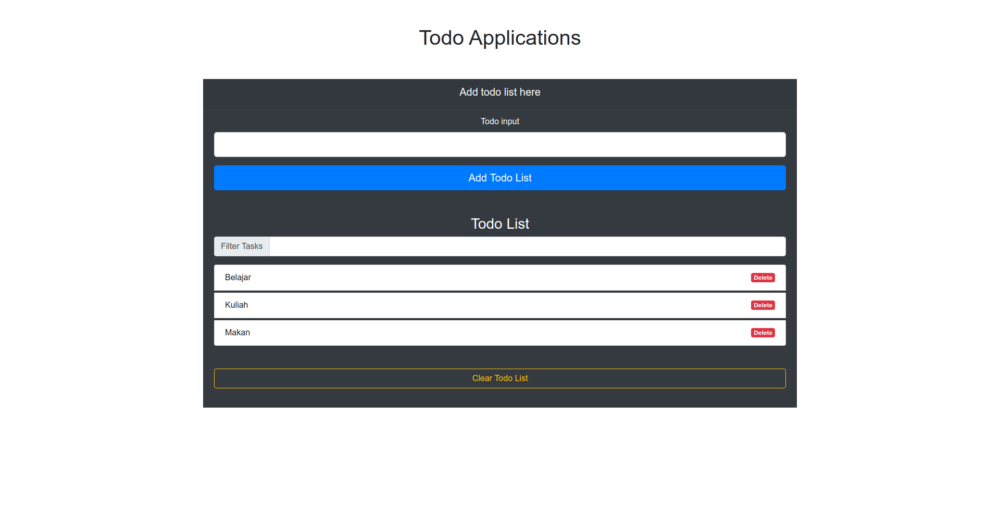

# TODO APPS

<pre>
    

        
    

</pre>

### Feature

* [x] <a href="javascript:void(0)">Add Data</a>
* [x] <a href="javascript:void(0)">Delete Data One By One</a>
* [x] <a href="javascript:void(0)">Clear Data (Delete All Data)</a>
* [x] <a href="javascript:void(0)">Search Data (Filter Data)</a>

### Tech Stack

* [x] <a href="https://getbootstrap.com/">Bootstrap</a>
* [x] <a href="http://vanilla-js.com/">Vanilla JS</a>
* [x] <a href="https://developer.mozilla.org/en-US/docs/Web/API/Window/localStorage">Local Storage</a>
